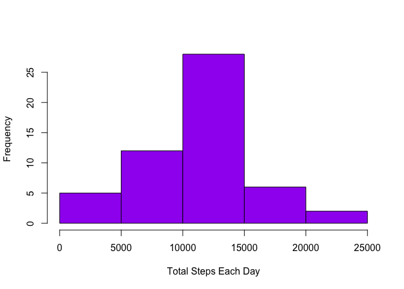
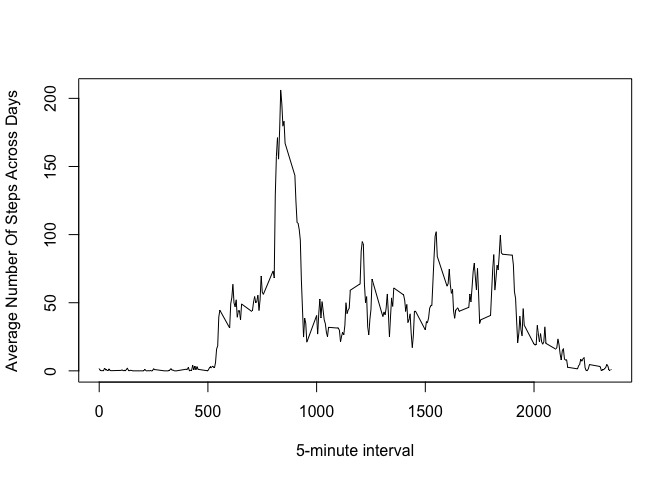

## Loading and preprocessing the data


```r
mydata <- read.csv("activity.csv")
mydata$date <- as.Date(mydata$date)
cleanNA <- subset(mydata, !is.na(mydata$steps))
```


## Histogram of the total number of steps each day

```r
library(ggplot2)
totalEachDay <- tapply(cleanNA$steps, cleanNA$date, sum)
qplot(totalEachDay, ylab = "Frequency", xlab = "Total steps per day", binwidth = 500)
```

<!-- -->

## What is mean total number of steps taken per day?


```r
options(scipen = 999) # disables exponential notation 
meanAcrossDays <- mean(totalEachDay)
```
The mean number of steps taken per day: 10766.1886792


## The median total number of steps taken per day:

```r
medianAcrossDays <- median(totalEachDay)
```
The median number of steps taken per day: 10765

## What is the average daily activity pattern?


```r
avgInterval <-tapply(cleanNA$steps, cleanNA$interval, mean, simplify = TRUE)
df_new <- data.frame(avg = avgInterval, interval = as.integer(names(avgInterval)))
plot(df_new$interval, df_new$avg, type = "l", xlab = "5-minute interval" , ylab = "Average Number Of Steps Across Days")
```

<!-- -->


## Imputing missing values


## Are there differences in activity patterns between weekdays and weekends?
